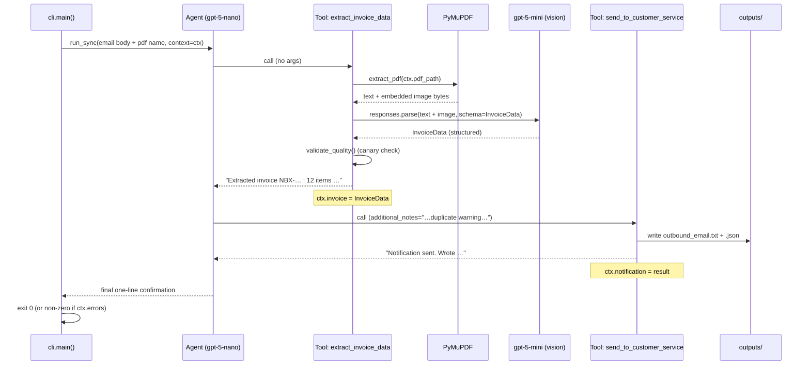

# How It Works — Architecture & Internals

This document explains **exactly** how the invoice-intake agent works: every
module, the data flow, the agent/tool design, the extraction call, the
anti-masking quality gate, error handling, exit codes, the Docker setup, and the
deliberate cost-control choices. It is the deep companion to the
[README](README.md) (which is the quick-start).

---

## Table of contents

1. [What the system does](#1-what-the-system-does)
2. [The core challenge: image-only fields](#2-the-core-challenge-image-only-fields)
3. [High-level architecture](#3-high-level-architecture)
4. [End-to-end execution walkthrough](#4-end-to-end-execution-walkthrough)
5. [Repository layout](#5-repository-layout)
6. [Module-by-module reference](#6-module-by-module-reference)
7. [The agent and its two tools](#7-the-agent-and-its-two-tools)
8. [The extraction call in detail](#8-the-extraction-call-in-detail)
9. [The data-quality gate (anti-masking)](#9-the-data-quality-gate-anti-masking)
10. [Error handling & exit codes](#10-error-handling--exit-codes)
11. [Cost / credit discipline](#11-cost--credit-discipline)
12. [Configuration & secrets](#12-configuration--secrets)
13. [Output formats](#13-output-formats)
14. [Docker & uv](#14-docker--uv)
15. [Testing](#15-testing)
16. [Extending the system](#16-extending-the-system)
17. [Known limitations](#17-known-limitations)

---

## 1. What the system does

Given an **inbound vendor email** (a JSON file) and its **PDF invoice
attachment**, the system:

1. Parses the email metadata and body.
2. Extracts the invoice's structured data from the PDF — both the text layer and
   any embedded image(s).
3. Produces a single **notification to Customer Service** containing:
   - a **human-readable summary** (`outputs/outbound_email.txt`), and
   - a **structured JSON payload** for downstream processing (`outputs/outbound_email.json`).

The orchestration is performed by an **agent** (built on the OpenAI Agents SDK)
that calls **two tools**: one that extracts invoice data, and one that sends the
notification.

---

## 2. The core challenge: image-only fields

The provided invoice (`data/Invoice.pdf`) deliberately hides its most important
header fields inside a **raster image on page 1**. These fields are **not** in
the PDF's text layer:

| Field | Where it lives |
|---|---|
| **Invoice number** (`NBX-260126-0174`) | **image only** (nowhere in text or email) |
| Invoice date (`2026-01-26`) | image (also appears as a page-header date) |
| **Due date** (`2026-02-25`) | **image only** |
| **Customer account** (`004913-MLHG`) | **image only** |
| Customer PO (`MLHG-PO-104772`) | image + email |
| Total due (`129,150.06`) | image + text (page 4) |

Everything else (line items, taxes, ship-to allocations, notes) lives in the
text layer across pages 2–8.

**Consequence:** a purely text-based parser cannot recover the invoice number.
A genuine **vision** read of the embedded image is required. This single fact
drives two design decisions:

- The extraction tool sends the embedded image to a vision-capable model.
- The **invoice number is used as a "canary"** for the quality gate (§9): if it
  comes back empty, the vision read demonstrably failed, and the run is treated
  as a failure rather than a blank success.

---

## 3. High-level architecture

```
                    ┌──────────────────────────────────────────────────────┐
                    │                      main.py                          │
                    │            (uv run python main.py --email …)          │
                    └───────────────────────────┬──────────────────────────┘
                                                │
                                                ▼
                    ┌──────────────────────────────────────────────────────┐
                    │                  cli.main()                           │
                    │  • load Settings (.env, model allow-list)             │
                    │  • load_email(Email.json)                             │
                    │  • _resolve_pdf()  → data/Invoice.pdf                 │
                    │  • run_agent(...)                                     │
                    │  • report + exit code                                 │
                    └───────────────────────────┬──────────────────────────┘
                                                │
                                                ▼
       ┌───────────────────────────────────────────────────────────────────────┐
       │                 Agent  (model: gpt-5-nano)                              │
       │                 instructions: 2-step plan                              │
       │                                                                        │
       │   step 1 ─────────────►  TOOL: extract_invoice_data                    │
       │                          ┌──────────────────────────────────────────┐ │
       │                          │ pdf_extract.extract_pdf  (PyMuPDF)        │ │
       │                          │   → text layer + embedded image bytes     │ │
       │                          │ extraction.extract_invoice                │ │
       │                          │   → ONE gpt-5-mini vision+text call        │ │
       │                          │   → InvoiceData (validated)               │ │
       │                          │ validate_quality()  ── canary gate        │ │
       │                          └──────────────────────────────────────────┘ │
       │                          stores result in  ctx.invoice                 │
       │                                                                        │
       │   step 2 ─────────────►  TOOL: send_to_customer_service                │
       │                          ┌──────────────────────────────────────────┐ │
       │                          │ notify.build_notification                 │ │
       │                          │   → render summary + JSON, write files     │ │
       │                          └──────────────────────────────────────────┘ │
       │                          stores result in  ctx.notification            │
       └───────────────────────────────────────────────────────────────────────┘
                                                │
                                                ▼
                              outputs/outbound_email.txt
                              outputs/outbound_email.json
```

**Key idea — the shared context:** the agent's LLM never sees the large invoice
payload. The extraction tool stores the full `InvoiceData` in a Python
`InvoiceRunContext` object; the notification tool reads it back from that same
object. The model only passes around tiny confirmation strings. This is the
single most important design choice for both **cost** (no giant payload in the
token stream) and **correctness** (no chance for the model to mistype 12 line
items).



---

## 4. End-to-end execution walkthrough

What happens, in order, on `uv run python main.py --email ./data/Email.json`:

1. **`main.py`** imports and calls `invoice_agent.cli.main()`.
2. **`cli.main()`** parses arguments (`--email`, optional `--pdf`,
   `--output-dir`).
3. **`Settings.from_env()`** loads the `.env` file, reads `OPENAI_API_KEY`, and
   validates the chosen models against the allow-list. Missing key or a
   disallowed model → printed error, **exit 2**.
4. **`load_email(args.email)`** parses the Microsoft Graph–shaped JSON into an
   `InboundEmail`. Bad/missing file → **exit 2**.
5. **`_resolve_pdf()`** finds the PDF: an explicit `--pdf` wins; otherwise it
   looks for the email's named attachment next to the email file, then in
   `data/`, then falls back to `data/Invoice.pdf`. Not found → **exit 2**.
6. The CLI prints the resolved paths and the models in use.
7. **`run_agent()`** builds the agent and an `InvoiceRunContext` (holding
   settings, the parsed email, and the resolved PDF path), then calls
   `Runner.run_sync(...)` with `max_turns=6`.
8. The agent (gpt-5-nano), following its instructions, **calls
   `extract_invoice_data`** first:
   - `pdf_extract.extract_pdf()` reads the text layer and extracts the embedded
     page-1 image bytes via PyMuPDF.
   - `extraction.extract_invoice()` makes **one** `gpt-5-mini` `responses.parse`
     call with the text + image and the `InvoiceData` schema as the required
     output format.
   - `validate_quality()` checks the canary fields; if missing it raises and the
     tool records a failure.
   - On success, the full `InvoiceData` is stored in `ctx.invoice` and a short
     confirmation string is returned to the model.
9. The agent then **calls `send_to_customer_service`**, optionally passing
   `additional_notes` summarizing email-specific context (PO match, Net 30,
   cost-centre routing, duplicate-quote warning):
   - `notify.build_notification()` renders the human summary and JSON payload
     (merging the invoice data with the email metadata) and writes both files.
   - The result is stored in `ctx.notification`.
10. The agent returns a one-line confirmation. Control returns to the CLI.
11. **`cli.main()` reports**: it prints any recorded errors, the notification
    preview, and the two output paths, then returns an **exit code** that
    reflects data quality (§10).

---

## 5. Repository layout

```
Info-Tech/
├── main.py                       # entrypoint  → invoice_agent.cli.main()
├── pyproject.toml                # uv project + dependencies
├── uv.lock                       # pinned, reproducible dependency graph
├── Dockerfile                    # uv-based container image
├── docker-compose.yml            # run config (env_file, volumes)
├── .dockerignore                 # keeps build context small; excludes secrets
├── .env.example                  # template for OPENAI_API_KEY
├── README.md                     # quick start
├── ARCHITECTURE.md               # this document
├── data/                         # inputs (provided)
│   ├── Email.json                #   inbound email
│   ├── Invoice.pdf               #   PDF attachment
│   └── .env                      #   secrets — gitignored, never committed
├── outputs/                      # generated notification artifacts
│   ├── outbound_email.txt
│   └── outbound_email.json
├── src/invoice_agent/            # the package
│   ├── __init__.py
│   ├── config.py                 # env loading + model allow-list + Settings
│   ├── email_loader.py           # parse Email.json → InboundEmail
│   ├── pdf_extract.py            # PyMuPDF: text + embedded images
│   ├── schema.py                 # Pydantic models + quality-gate field sets
│   ├── extraction.py             # the single vision+text extraction call
│   ├── notify.py                 # render summary + JSON, write files
│   ├── agent.py                  # Agents SDK agent + two tools + run context
│   └── cli.py                    # argparse, path resolution, exit codes
└── tests/
    ├── smoke_no_api.py           # offline plumbing test (no API)
    └── test_quality_gate.py      # offline anti-masking test (no API)
```

---

## 6. Module-by-module reference

### `config.py` — settings, secrets, model allow-list

- **`ALLOWED_MODELS = ("gpt-5-mini", "gpt-5-nano")`** — the only models the
  assignment permits. `_validate_model()` raises `ValueError` for anything else,
  so a disallowed model can never be used (even via env override).
- **`load_environment()`** loads the first `.env` it finds, searching:
  `<root>/.env` → `<root>/data/.env` → `<cwd>/.env`. It uses `override=False`
  so a value already present in the real environment (e.g. injected by Docker)
  is never clobbered.
- **`Settings`** (frozen dataclass) holds `openai_api_key`, `agent_model`,
  `extraction_model`, `reasoning_effort`, and `output_dir`.
  `Settings.from_env()` builds it, raising `RuntimeError` if `OPENAI_API_KEY` is
  absent. Defaults: agent `gpt-5-nano`, extraction `gpt-5-mini`, effort `low`,
  output `./outputs`. All are overridable by env vars (§12).

### `email_loader.py` — parse the inbound email

- **`InboundEmail`** dataclass: `subject`, `body`, `from_name`, `from_address`,
  `to`, `cc`, `attachment_names`, `sent_datetime`, `source_path`.
- **`load_email(path)`** accepts both the `{"Message": {...}}` Graph envelope and
  a bare message object. Raises `FileNotFoundError` / `ValueError` on
  missing/invalid input.
- **`first_pdf_attachment`** returns the first `.pdf` attachment name — used by
  the CLI to locate the PDF.
- **`to_summary_dict()`** returns a compact, JSON-safe view of the email (no raw
  bytes); this is embedded in the output payload so the notification carries its
  provenance.

### `pdf_extract.py` — deterministic PDF parsing (no LLM)

- **`extract_pdf(path)`** opens the PDF with PyMuPDF (`fitz`) and returns a
  **`PdfContent`** with `text` (all pages concatenated), `images` (a list of
  `EmbeddedImage`), and `page_count`.
- **`EmbeddedImage`** carries the raw bytes plus a **`data_url`** property that
  base64-encodes them into a `data:image/png;base64,…` URI for the vision call.
- **Guardrails:** images smaller than `64×64` are skipped (`_MIN_IMAGE_PIXELS`),
  and at most `4` images are kept (`_MAX_IMAGES`) — so we never flood the vision
  call with spurious or huge images. Per-image extraction failures are skipped
  individually.
- **Failure modes:** missing file → `FileNotFoundError`; unreadable file →
  `ValueError`; a PDF that yields *neither* text *nor* images → `ValueError`.

### `schema.py` — the data contract

- Pydantic models: **`LineItem`**, **`TaxLine`**, **`SiteAllocation`**, and the
  top-level **`InvoiceData`**. Every field is **optional** so partial extraction
  degrades gracefully rather than throwing.
- **`CRITICAL_FIELDS = ("invoice_number", "total_due")`** — the load-bearing
  fields used by the quality gate (§9).
- **`IMAGE_HEADER_FIELDS`** — the six header fields that live (wholly or partly)
  in the page-1 image; used to emit non-fatal warnings when any are empty.
- **`_is_empty(value)`** — treats `None` / `""` / `[]` as empty but **not** `0`
  or `0.0` (so a legitimately zero amount is not misread as missing).
- **`missing_critical_fields()`** and **`missing_header_fields()`** — the two
  helpers that power the gate and the warnings, respectively.

### `extraction.py` — the LLM extraction (detailed in §8)

- **`extract_invoice(pdf, *, api_key, model, reasoning_effort)`** — one
  `responses.parse` call returning a validated `InvoiceData`.
- **`ExtractionQualityError`** and **`validate_quality(data)`** — the gate (§9).

### `notify.py` — render and persist the notification

- **`build_notification(invoice, email, output_dir, extra_notes)`** writes:
  - **`outbound_email.txt`** — a sectioned, human-readable summary built
    deterministically from the data (so nothing is hallucinated). Sections:
    header, **Invoice Summary**, **Tax Breakdown**, **Line Items**,
    **Ship-To / Site Allocations**, **Cost Centres**, **Important Notes**,
    **Source Email**, **Agent Notes**, and **Data Quality Warnings** (only if
    any exist).
  - **`outbound_email.json`** — a structured payload: `notification_type`,
    `generated_at` (UTC), `recipient`, `agent_notes`, the full `invoice`
    (`model_dump()`), and `source_email`.
- **`_money(value, currency)`** renders `None` as `—` (a visible blank, never a
  fabricated number).
- Returns a **`NotificationResult`** (`text_path`, `json_path`, `summary_text`,
  `payload`).

### `agent.py` — the agent, tools, and context (detailed in §7)

### `cli.py` — argument parsing, path resolution, exit codes (detailed in §10)

### `main.py` — the entrypoint

A three-line shim that calls `invoice_agent.cli.main()` so the assignment's
exact command works: `uv run python main.py --email ./data/Email.json`.

---

## 7. The agent and its two tools

The agent is built with the **OpenAI Agents SDK** (`agents` package):

```python
Agent[InvoiceRunContext](
    name="Invoice Intake Agent",
    instructions=_INSTRUCTIONS,            # a strict 2-step plan
    model=settings.agent_model,            # gpt-5-nano
    tools=[extract_invoice_data, send_to_customer_service],
    model_settings=ModelSettings(reasoning=Reasoning(effort="low")),
)
```

### The run context

```python
@dataclass
class InvoiceRunContext:
    settings: Settings
    email: InboundEmail
    pdf_path: Path
    invoice: InvoiceData | None = None        # filled by tool 1
    notification: NotificationResult | None = None  # filled by tool 2
    errors: list[str] = field(default_factory=list)
```

This object is passed to `Runner.run_sync(..., context=ctx)`. Each tool receives
it as `wrapper.context`. **It is invisible to the model** — it is plain Python
state. This is how the 12-line-item payload moves from tool 1 to tool 2 without
ever entering the token stream.

### Tool 1 — `extract_invoice_data(wrapper)`

Takes **no model-visible arguments**. It:

1. Calls `extract_pdf(ctx.pdf_path)`. On `FileNotFoundError`/`ValueError` it
   appends to `ctx.errors` and returns an `ERROR …` string (no exception
   escapes to the model).
2. Calls `extract_invoice(...)`. On `ExtractionQualityError` (the canary gate)
   it records a **failure** in `ctx.errors` and returns an error string **without
   setting `ctx.invoice`**. On any other exception it does the same with a
   generic message.
3. On success, sets `ctx.invoice` and returns a **compact** confirmation string
   (invoice number, item count, total, site count, warning count) — small on
   purpose.

### Tool 2 — `send_to_customer_service(wrapper, additional_notes="")`

1. Guards: if `ctx.invoice is None`, returns an error (so a notification can
   never be produced from missing data).
2. Calls `build_notification(ctx.invoice, ctx.email, ctx.settings.output_dir,
   additional_notes)` — which **merges** the structured invoice with the email
   metadata and writes both files.
3. Sets `ctx.notification` and returns a confirmation string.

`additional_notes` is the agent's one creative contribution: it reads the email
body and writes a short free-text note flagging things AP needs that may not be
in the invoice (PO match, Net 30, cost-centre routing, and especially the
**duplicate-quote warning**). The factual invoice data itself is rendered
deterministically, not retyped by the model.

### The instructions

The agent is told to: (1) call `extract_invoice_data` once, (2) call
`send_to_customer_service` once with `additional_notes`, (3) reply with a
one-line confirmation — and to **never fabricate data** or re-call a successful
tool. `max_turns=6` bounds the loop as a backstop.

---

## 8. The extraction call in detail

`extract_invoice()` makes a **single** call to the OpenAI **Responses API** with
structured outputs:

```python
response = client.responses.parse(
    model=model,                       # gpt-5-mini
    input=[
        {"role": "system", "content": _SYSTEM_PROMPT},
        {"role": "user", "content": [
            {"type": "input_text",  "text": "...instructions... <<<INVOICE_TEXT>>> ..."},
            {"type": "input_image", "image_url": "data:image/png;base64,..."},  # page-1 image
        ]},
    ],
    text_format=InvoiceData,           # structured output → Pydantic
    reasoning={"effort": reasoning_effort},   # "low"
    max_output_tokens=6000,
)
data = response.output_parsed          # an InvoiceData instance, or None
```

Design points:

- **Text + image in one message.** The already-extracted text layer is sent as
  text (cheaper and more reliable than asking the model to OCR everything), and
  the embedded page-1 image is attached for the fields that exist only there.
- **`text_format=InvoiceData`** forces the model to return JSON conforming to the
  Pydantic schema, validated at the SDK layer. We don't hand-parse JSON or pay
  for re-asking on malformed output.
- **`reasoning={"effort": "low"}`** keeps reasoning-token spend down; the task is
  extraction against provided material, not hard reasoning.
- **`max_output_tokens=6000`** is generous enough for the full payload but bounds
  runaway generation.
- **The prompt** instructs: extract only from the supplied material, never invent
  values, normalize numbers to plain decimals and dates to `YYYY-MM-DD`, and
  derive `payment_terms` from the date delta (e.g. `Net 30`).

If `response.output_parsed` is `None` (truncated/refused), the function **raises
`RuntimeError`** rather than retrying — failing fast and cheap.

---

## 9. The data-quality gate (anti-masking)

The single most important correctness guarantee: **the program must never appear
to succeed when the extraction did not actually work.**

A degraded vision read can return *structurally valid* JSON with the image-only
fields empty. Without a gate, that would still write files and exit 0 — a
failure dressed up as success. The gate prevents this.

### The canary

```python
CRITICAL_FIELDS = ("invoice_number", "total_due")

def validate_quality(data: InvoiceData) -> None:
    missing = data.missing_critical_fields()
    if missing:
        raise ExtractionQualityError(missing)
```

`invoice_number` is the decisive signal: it exists **only** in the page-1 image
(not in the PDF text, not in the email). So if it comes back empty, the vision
read demonstrably failed. `total_due` is a universal invoice sanity field.

### How a failure propagates to a non-zero exit

```
extraction.extract_invoice()
    └─ validate_quality(data)  ── raises ExtractionQualityError
          │
          ▼
agent.extract_invoice_data (except ExtractionQualityError)
    ├─ ctx.errors.append("extraction quality check failed: …")
    └─ returns "ERROR: …"   ── and does NOT set ctx.invoice
          │
          ▼
agent.send_to_customer_service
    └─ ctx.invoice is None  → returns ERROR, writes nothing
          │                    (ctx.notification stays None)
          ▼
cli.main()
    ├─ ctx.notification is None  → "[failure] No notification produced" → return 1
    └─ (defense in depth) if ctx.errors → return 1 even if a file existed
```

There are **two independent gates** in the CLI: `ctx.notification is None` and
`ctx.errors` non-empty. The **only** path to `return 0` is *notification
produced AND zero recorded errors*. A degraded extraction satisfies neither.

### What it does and does not catch

- **Catches:** an *empty* extraction — the vision read produced nothing usable
  (the exact failure-masking scenario). Verified offline in
  `tests/test_quality_gate.py`.
- **Does not catch:** a *wrong-but-non-empty* value (a hallucinated invoice
  number). Detecting that would require ground truth the system does not have.
  This limitation is stated explicitly rather than hidden.

### Non-fatal warnings

Empty *header* fields that are not critical (e.g. `due_date`,
`customer_account`) do not fail the run; instead they are appended to
`extraction_warnings`, which surfaces in a **Data Quality Warnings** section of
both outputs. Partial degradation is visible without being fatal.

---

## 10. Error handling & exit codes

Every failure mode maps to a clear message and a specific exit code:

| Situation | Where handled | Exit code |
|---|---|---|
| Missing `OPENAI_API_KEY` or disallowed model | `Settings.from_env()` | **2** |
| Missing / invalid email JSON | `load_email()` → `cli` | **2** |
| PDF attachment not found | `_resolve_pdf()` → `cli` | **2** |
| Unreadable / empty PDF | `extract_pdf()` → tool → `ctx.errors` | **1** |
| OpenAI API / network / SDK error | `run_agent` exception → `cli` | **1** |
| Model returned unparseable output | `extract_invoice` raises → tool | **1** |
| **Empty/degraded extraction (canary missing)** | `validate_quality` → gate | **1** |
| Agent produced no notification | `cli` (`ctx.notification is None`) | **1** |
| Any recorded error, even with a file written | `cli` (`ctx.errors`) | **1** |
| Success — full data, no errors | `cli` | **0** |

**Exit-code summary:**

- **0** — success (notification produced, zero errors).
- **1** — runtime failure (extraction/agent/quality/notification problem).
- **2** — setup/input failure (config, email, or attachment) before the agent runs.

Note the layering: input/config problems are caught *before* the agent ever runs
(exit 2, cheap — no API call). Runtime and data-quality problems surface as
exit 1.

---

## 11. Cost / credit discipline

The provided key has strict limits, so the design avoids waste deliberately:

- **One extraction call.** All fields come from a single `responses.parse` call;
  there is no per-field calling and no speculative retry.
- **No retry loops.** On unparseable output or API error the code fails fast
  rather than re-asking and burning credits.
- **Low reasoning effort** on both the agent (`gpt-5-nano`) and the extraction
  (`gpt-5-mini`).
- **Compact prompt.** We send the already-extracted text layer, not the raw PDF;
  the prompt is targeted, not a giant dump.
- **Shared-context payload passing.** The 12-line-item result never round-trips
  through the model — only short confirmation strings do.
- **`max_turns=6`** caps the agent loop as a backstop against runaway behavior.
- **Structured outputs** avoid paying again to re-parse malformed JSON.
- **Cheap model for orchestration.** `gpt-5-nano` drives the trivial two-step
  plan; the more capable `gpt-5-mini` is reserved for the one vision call.

A typical successful run is roughly: one nano turn to call tool 1, one mini
vision+text extraction call, one nano turn to call tool 2, one nano turn to
confirm.

---

## 12. Configuration & secrets

Secrets are read from a `.env` file (never committed; `.env` is in
`.gitignore`). The loader searches `<root>/.env`, then `<root>/data/.env`, then
`<cwd>/.env`, and never overrides values already in the real environment.

| Env var | Default | Purpose |
|---|---|---|
| `OPENAI_API_KEY` | *(required)* | OpenAI API key |
| `AGENT_MODEL` | `gpt-5-nano` | orchestration model (allow-list enforced) |
| `EXTRACTION_MODEL` | `gpt-5-mini` | vision/text extraction model (allow-list enforced) |
| `REASONING_EFFORT` | `low` | reasoning effort for the extraction call |
| `OUTPUT_DIR` | `./outputs` | where the notification artifacts are written |

CLI flags `--email`, `--pdf`, and `--output-dir` override the corresponding
paths at runtime.

---

## 13. Output formats

### `outbound_email.txt` (human-readable)

A sectioned plain-text summary. Abbreviated shape:

```
ACTION REQUIRED: Vendor invoice ready for processing
====================================================
To: Customer Service / Accounts Payable
Re: Invoice NBX-260126-0174 from Northbridge Office Furnishings Inc.

INVOICE SUMMARY
  Vendor / Invoice # / dates / terms / currency / account / PO
  Subtotal / Total tax / TOTAL DUE

TAX BREAKDOWN          (per jurisdiction: HST / GST / QST)
LINE ITEMS (12)        (sku | description | qty × unit = total)
SHIP-TO / SITE ALLOCATIONS  (per-site items, cost centre, delivery window)
COST CENTRES FOR APPROVAL ROUTING
IMPORTANT NOTES        (delivery windows, receiving rules, duplicate warning)
SOURCE EMAIL           (from / subject / sent)
AGENT NOTES            (the agent's email-context summary)
DATA QUALITY WARNINGS  (only present if any warnings exist)
```

Missing values render as `—` (a visible blank), never a fabricated value.

### `outbound_email.json` (structured payload)

```jsonc
{
  "notification_type": "invoice_intake",
  "generated_at": "2026-06-30T…Z",
  "recipient": "Customer Service / Accounts Payable",
  "agent_notes": "…the agent's free-text email context…",
  "invoice": {
    "vendor_name": "Northbridge Office Furnishings Inc.",
    "invoice_number": "NBX-260126-0174",
    "invoice_date": "2026-01-26",
    "due_date": "2026-02-25",
    "payment_terms": "Net 30",
    "currency": "CAD",
    "customer_account": "004913-MLHG",
    "customer_po_number": "MLHG-PO-104772",
    "subtotal": 113983.69,
    "total_tax": 15166.37,
    "total_due": 129150.06,
    "taxes": [ { "jurisdiction": "...", "tax_type": "...", "taxable_amount": 0, "tax_amount": 0 } ],
    "line_items": [ { "line": 1, "sku": "...", "description": "...", "quantity": 0, "unit_price": 0, "line_total": 0 } ],
    "ship_to_sites": [ { "site": "...", "cost_centre": "...", "address": "...", "items": ["..."], "delivery_window": "...", "delivery_service": "..." } ],
    "cost_centres": ["TOR-OPS-221", "OTT-TRN-114", "MTL-ADM-038"],
    "important_notes": ["..."],
    "extraction_warnings": []
  },
  "source_email": { "subject": "...", "from": "...", "to": [...], "cc": [...], "sent": "...", "attachments": ["Invoice.pdf"], "body": "..." }
}
```

The payload is self-contained: it carries both the extracted invoice **and** the
source email, so a downstream system has full provenance.

---

## 14. Docker & uv

### `pyproject.toml` + `uv.lock`

The project is a `uv`-managed package. Dependencies: `openai-agents`, `openai`,
`pymupdf`, `pydantic`, `python-dotenv`. `uv.lock` pins the entire graph for
reproducible builds. `uv sync` creates the virtual environment; `uv run` runs
inside it.

### `Dockerfile`

Built on `ghcr.io/astral-sh/uv:python3.12-bookworm-slim` (ships uv + CPython
3.12). Layering is chosen for cache efficiency:

```dockerfile
ENV UV_COMPILE_BYTECODE=1  UV_LINK_MODE=copy  UV_PYTHON_DOWNLOADS=never
WORKDIR /app
COPY pyproject.toml uv.lock* ./
RUN uv sync --no-install-project --no-dev    # 1) deps only — cached unless deps change
COPY README.md ./
COPY src ./src
COPY main.py ./
RUN uv sync --no-dev                         # 2) install the project itself
ENTRYPOINT ["uv", "run", "python", "main.py"]
CMD ["--email", "./data/Email.json"]
```

Step 1 installs third-party dependencies independent of the source, so it is
only re-run when dependencies change. PyMuPDF ships manylinux wheels, so no
system build tools are needed.

### `docker-compose.yml`

```yaml
services:
  agent:
    build: .
    image: invoice-intake-agent
    env_file: [ ./data/.env ]          # OPENAI_API_KEY injected at runtime
    environment:                        # optional overrides
      AGENT_MODEL: ${AGENT_MODEL:-gpt-5-nano}
      EXTRACTION_MODEL: ${EXTRACTION_MODEL:-gpt-5-mini}
      REASONING_EFFORT: ${REASONING_EFFORT:-low}
    volumes:
      - ./data:/app/data:ro            # inputs, read-only
      - ./outputs:/app/outputs         # results written back to the host
```

Run: `docker compose run --rm agent`. Inputs come from the read-only `./data`
mount; results appear in the host `./outputs`. The secret is **injected at
runtime** via `env_file` — it is never copied into the image (and `.dockerignore`
excludes `.env` and `data/` from the build context).

---

## 15. Testing

Two **offline** test scripts run without any API call (so they cost nothing and
catch regressions fast):

- **`tests/smoke_no_api.py`** — verifies the plumbing: imports resolve
  (including the Agents SDK), the email parses, PyMuPDF extracts the text and the
  embedded image, and `build_notification` renders both files. It uses a
  hard-coded `InvoiceData` fixture *only* to exercise rendering — this fixture is
  never imported by the production path, so a passing smoke test proves plumbing,
  **not** that extraction works.
- **`tests/test_quality_gate.py`** — verifies the anti-masking gate directly:
  an all-null extraction, a missing-canary extraction, and a missing-total
  extraction are each **rejected** (`ExtractionQualityError`), while a complete
  extraction **passes**. This is the offline proof that a failed vision read
  cannot present as success.

Run them:

```bash
uv run python tests/smoke_no_api.py
uv run python tests/test_quality_gate.py
```

End-to-end (one real API run) is exercised via `docker compose run --rm agent`
or the `uv run python main.py …` command.

---

## 16. Extending the system

- **Different email/invoice:** pass `--email path/to/email.json`; the PDF is
  resolved from the email's named attachment (or pass `--pdf`).
- **Different output location:** `--output-dir` or `OUTPUT_DIR`.
- **Add an extracted field:** add it to the relevant Pydantic model in
  `schema.py`; if it must come from the image, mention it in the extraction
  prompt; render it in `notify._build_summary`.
- **Make a field load-bearing:** add it to `CRITICAL_FIELDS` and the gate will
  fail the run when it is empty.
- **A real "send" channel:** `send_to_customer_service` currently writes files;
  swap `notify.build_notification` (or add a step) to POST to an email/ticketing
  API. The tool boundary already isolates this.
- **Swap the model:** set `AGENT_MODEL` / `EXTRACTION_MODEL` (allow-list
  enforced to `gpt-5-mini` / `gpt-5-nano`).

---

## 17. Known limitations

- **Empty vs. wrong:** the quality gate detects an *empty* extraction, not a
  *hallucinated-but-plausible* value. Catching the latter would require ground
  truth the system does not have.
- **Single image assumption:** the design targets the provided invoice's page-1
  header image. Other invoices with fields spread across many images would still
  work (up to `_MAX_IMAGES`), but the canary (`invoice_number`) assumption is
  tuned to this document.
- **Orchestration model variance:** `gpt-5-nano` drives the two-step plan
  reliably for this simple flow; a much more complex workflow might warrant
  `gpt-5-mini` for orchestration too (still within the allow-list).
- **One-shot extraction:** by design there is no retry, so a transient API error
  fails the run (cleanly, exit 1) rather than retrying — a deliberate trade-off
  for credit safety.
